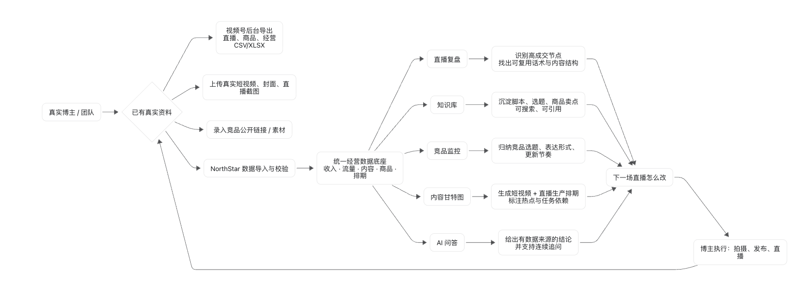
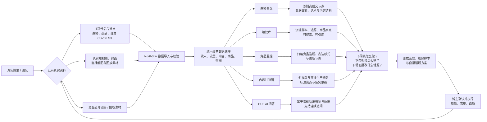

# NorthStar 北极星

面向同时制作短视频、开展直播的博主与运营团队的内容经营工作台。

让真实经营数据与内容经验，回答三个问题：**下周该怎么做、下条视频怎么拍、下场直播改什么话题？**

[打开交互式产品演示](http://106.53.42.148/showcase/) · [查看操作录屏](http://106.53.42.148/showcase/#recordings) · [项目交接与部署说明](PROJECT_HANDOFF.md)

## 产品使用流程

以下流程展示产品总体设计，包括规划中的 AI 能力。数据导入、复盘展示和排期已有实现基础，自动竞品监控、多模态分析与真实 AI 推理仍需接入。

### 可编辑流程图

## 核心功能与价值

| 功能 | 用户得到什么 |
| --- | --- |
| 数据复盘 | 将同场数据、趋势与画面关联查看，减少跨后台抄表和拼接复盘记录。多模态分析的目标是辅助检查话术、内容、灯光和构图。 |
| 知识库与竞品观察 | 汇集历史脚本、直播话术、视频钩子与竞品参考。自动拆稿的目标是减少逐字整理，沉淀可复用的编导经验。 |
| CUE AI 助手 | 围绕“上一场怎么样”“下一周怎么做”提供带依据的回答与追问。 |
| 内容甘特图 | 把全年主题和每周重点落到选题、脚本、拍摄发布与开播任务。 |
| 内容生成 | 形成下一场直播话题与下周视频脚本，交由博主确认、调整后开拍。 |

当前采用用户导出报表后上传的方式接入数据，不依赖尚未获得的视频号官方接口。演示页对真实资料、预设交互与规划功能分别标明状态。

## 项目资料

- [PROJECT_HANDOFF.md](PROJECT_HANDOFF.md)：功能边界、部署现状与后续优先级。
- [后端说明](backend/README.md)：后端开发资料。
- [导出说明](README-导出说明.md)：项目导出相关说明。
- [产品展示源码](frontend/public/showcase/)：截图、交互导览与章节录屏。
